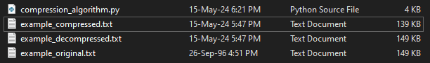

# Compressão de Dados: Como funciona?
A compressão de dados é uma técnica fundamental em computação, utilizada para reduzir o tamanho de arquivos e otimizar o armazenamento e a transmissão de informações. Embora possa parecer um conceito complexo à primeira vista, a essência por trás da compressão de dados é surpreendentemente simples e acessível, como demonstrado pelo algoritmo que desenvolvemos abaixo. Vamos explorar como esse algoritmo simplificado pode nos ajudar a entender melhor a compressão de dados e como ele pode ser aplicado e aprimorado para diferentes tipos de dados.


## Algoritmo desenvolvido para exemplificar

Abaixo está o conjunto de mapeamento de caracteres repetidos no texto que desejamos comprimir. Para este exemplo, utilizamos o texto em inglês alice29.txt. (The Canterbury Corpus)
```Python
# Common words mapped to single characters prefixed with underscore
word_mapping = {
    "the": "_a", 
    "and": "_b", 
    "say": "_c", 
    "she": "_d", 
    "her": "_e", 
    "that": "_f",
    "have": "_g", 
    "with": "_h", 
    "what": "_i", 
    "for": "_j", 
    "not": "_k", 
    "was": "_l",
    "very": "_m", 
    "Alice": "_n", 
    "thing": "_o", 
    "said": "_p", 
    "this": "_q", 
    "down": "_r",
    "you": "_s", 
    "how": "_t", 
    "but": "_u", 
    "from": "_v", 
    "went": "_w", 
    "get": "_x",
    "will": "_y", 
    "my": "_z", 
    "one": "_0", 
    "all": "_1", 
    "would": "_2", 
    "there": "_3",
    "their": "_4", 
    "if": "_5", 
    "about": "_6", 
    "which": "_7", 
    "out": "_8", 
    "so": "_9"
}
```
A ideia é que com este mapeamento possamos substituir palavras frequentes no texto por caracteres que ocupem menos espaço, dessa forma reduzindo o tamanho do arquivo. Além disso, podemos nos referir a esta tabela no processo de descompressão, mantendo a integridade dos dados originais.


Como este algoritmo foi desenvolvido para exemplificação, claro que algumas palavras podem ser mapeadas de forma melhor. Como é o caso de "my", "if" e "so", que são substituídas por cadeias de caracteres de mesmo tamanho neste exemplo.


O algoritmo opera em duas etapas principais: compressão e descompressão. Durante a compressão, o texto é percorrido palavra por palavra, e cada palavra comum é substituída por seu equivalente comprimido, de acordo com um mapa predefinido. O texto resultante é então armazenado em um arquivo comprimido. Na etapa de descompressão, o processo é revertido: o texto comprimido é lido e as palavras comprimidas são substituídas por suas versões originais, reconstruindo assim o texto original.


Abaixo está a função que percorre o arquivo de texto e realiza a compressão. O código foi desenvolvido em Python e está comentado para melhor compreensão de cada etapa.
```Python
def compress_file(input_file, output_file):
    try:
        with open(input_file, 'r') as f_in:
            data = f_in.read()  # Leitura do texto
        
        compressed_data = ""
        word_buffer = ""
        for char in data:
            if char.isalpha(): # Verificamos se o caractere lido é alfabético, como estamos mapeando só palavras em inglês
                word_buffer += char  # Construção da palavra em nosso buffer
            else:
                if word_buffer:
                    compressed_data += word_mapping.get(word_buffer, word_buffer)  # Substituição da palavra no buffer usando nossa tabela de mapeamento caso haja correspondência
                    word_buffer = ""
                compressed_data += char  # Adicionamos caracteres não alfabéticos como eles são, para não perder dados
        
        if word_buffer:
            compressed_data += word_mapping.get(word_buffer, word_buffer)  # Substituição da palavra no buffer usando nossa tabela de mapeamento caso haja correspondência
        
        with open(output_file, 'w') as f_out:
            f_out.write(compressed_data)  # Escrita do arquivo com o texto comprimido
        
        print("File compressed successfully!")
    
    except FileNotFoundError:
        print("Input file not found.")
```

###### Imagem exemplificando o texto após aplicação do algoritmo de compressão. (Fonte: autor)


E esta é a função utilizada na descompressão:
```Python
def decompress_file(input_file, output_file):
    try:
        with open(input_file, 'r') as f_in:
            compressed_data = f_in.read()  # Leitura dos dados comprimidos
        
        decompressed_data = ""
        word_buffer = ""
        for char in compressed_data:
            if char.isalpha() or char.isdigit() or char == "_": # Verificação por nosso prefixo e valores [a-z0-9]
                word_buffer += char  # Construção da palavra, caractere por caractere
            else:
                if word_buffer:
                    for common_word, mapped_char in word_mapping.items():
                        if mapped_char == word_buffer:
                            decompressed_data += common_word  # Restauração da palavra original
                            break
                    else:
                        decompressed_data += word_buffer  # Manutenção de outros caracteres ou palavras não mapeadas
                    word_buffer = ""
                decompressed_data += char  # Adição de caracteres não alfabéticos (como espaços e outros símbolos)
        
        if word_buffer:
            for common_word, mapped_char in word_mapping.items():
                if mapped_char == word_buffer:
                    decompressed_data += common_word  # Restauração da palavra original
                    break
            else:
                decompressed_data += word_buffer  # Manutenção de outros caracteres ou palavras não mapeadas
        
        with open(output_file, 'w') as f_out:
            f_out.write(decompressed_data)  # Escrita dos dados descomprimidos
        
        print("File decompressed successfully!")
    
    except FileNotFoundError:
        print("Input file not found.")
```

Juntando todo o código em um arquivo e utilizando-o para comprimir o texto alice29.txt obtivemos o seguinte resultado.
```Python
# Exemplo de uso:
input_file = 'example_original.txt'
compressed_file = 'example_compressed.txt'
decompressed_file = 'example_decompressed.txt'


# Comprimir arquivo
compress_file(input_file, compressed_file)


# Descomprimir arquivo
decompress_file(compressed_file, decompressed_file)
```

###### Imagem mostrando o tamanho do arquivo comprimido e descomprimido após aplicação do algoritmo. (Fonte: autor)


Dessa forma, notamos que através da aplicação de nosso algoritmo conseguimos reduzir o tamanho do arquivo original em 10KB apenas com a técnica de substituição das palavras que mapeamos.

Podemos observar também que o arquivo descomprimido "example_decompressed.txt" foi capaz de ser restaurado ao tamanho do arquivo original "example_original.txt", dessa forma mantendo a integridade dos dados.


## Expansão para outros tipos de dados

Embora tenhamos exemplificado a compressão de dados usando texto, o mesmo princípio pode ser aplicado a uma variedade de tipos de dados, incluindo imagens, áudio e vídeo. Por exemplo, em imagens, pixels comuns ou padrões repetitivos podem ser representados de forma mais eficiente por meio de algoritmos de compressão como JPEG ou PNG. Da mesma forma, em áudio e vídeo, partes redundantes podem ser removidas ou representadas de forma mais compacta, reduzindo assim o tamanho do arquivo.


Além disso, é importante notar que nosso algoritmo de compressão pode ser aprimorado e adaptado para lidar com diferentes tipos de dados. Por exemplo, podemos criar mapas de compressão mais sofisticados que levem em consideração padrões específicos de cada tipo de dado. Também podemos explorar técnicas avançadas de compressão, como algoritmos de compressão sem perdas e com perdas, dependendo dos requisitos de qualidade e espaço.


## Conclusão

A compressão de dados pode parecer um conceito complexo à primeira vista, mas, como vimos, a essência por trás dela é surpreendentemente simples e acessível. Ao entendermos os princípios básicos por trás da compressão de dados e explorarmos exemplos práticos, como o algoritmo que desenvolvemos, podemos desmistificar esse conceito e apreciar sua importância e aplicabilidade em diversos contextos da computação moderna. Com o uso de algoritmos simples e inteligentes, podemos otimizar o armazenamento e a transmissão de dados, tornando nossas operações mais eficientes e econômicas.


## Referências

[1] [The Canterbury Corpus](https://corpus.canterbury.ac.nz/descriptions/#cantrbry). Acesso em: 15 maio 2024.

[2] [Data Compression Algorithms](https://www.dremio.com/wiki/data-compression-algorithms/). Acesso em: 15 maio 2024.

[3] [The need for compression](https://www.khanacademy.org/computing/computers-and-internet/xcae6f4a7ff015e7d:digital-information/xcae6f4a7ff015e7d:data-compression/a/file-compression-introduction). Acesso em: 15 maio 2024.